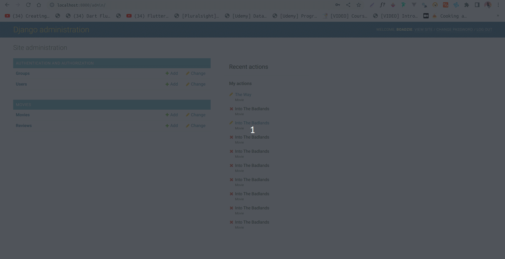

# MovieMan


> A Django movie application with pagination, search and authorization

## Features

1. CRUD functionality

2. Authorization(admin only)



3. Pagination support

4. File upload support

5. Styled with Tailwindcss


## How to Run

1. Create a virtual environment with `venv` or any other

```bash
python -m venv myenv
```
2. Install the package from the `requirements.txt` file

```bash
pip install -r requirements.txt
```
3. Run the application with:

```bash
python manage.py runserver
```
and then run the tailwindcss server with:

```bash
python manage.py tailwind start
```
in a new terminal shell.

4. Visit `http://localhost:8000/` to the see the app.
